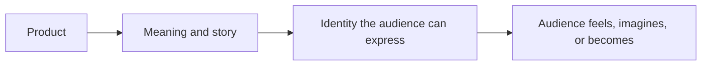

# Chapter 2: Brand Archetypes and Meaning

A product is never experienced as only its physical materials. People also notice what it seems to stand for, who appears to use it, and what choosing it might say about them. Brand archetypes give designers a practical way to shape that meaning.

## What Is a Brand Archetype?

An archetype is a generalized cultural and narrative pattern. It gives an audience a familiar way to interpret a brand, product, organization, or experience. An **Explorer** suggests discovery and independence. A **Sage** suggests knowledge and understanding. A **Caregiver** suggests protection and support.

Archetypes are useful because they connect many design decisions. A brand's language, visual style, product details, customer experience, and community can all reinforce the same broad promise. The goal is not to label people permanently. The practical question is:

> What does the audience get to feel, imagine, or become by choosing this brand?

Archetypes are models, not literal personality diagnoses. They are not scientific tests that reveal a person's true character, and they are not rigid boxes for every brand. A person or brand can contain multiple tendencies. A company might be a **Sage** when explaining a complex topic, a **Caregiver** when supporting customers, and a **Creator** when developing a new tool. Cultural context also matters: symbols, colors, stories, and ideas of authority or independence can mean different things to different audiences.

## Common Brand Archetypes

The following set is a practical vocabulary rather than a final or universal list.

| Archetype | Central desire | Audience may feel, imagine, or become | Useful brand signals |
| --- | --- | --- | --- |
| Explorer | Freedom and discovery | Independent, capable, ready for what is next | Open horizons, invitations to try, adaptable products |
| Sage | Understanding and truth | Informed, thoughtful, better able to judge | Evidence, explanations, clarity, teaching |
| Creator | Making something original | Expressive, inventive, able to shape the world | Craft, experimentation, tools, distinctive work |
| Ruler | Order and control | Confident, established, in command | Standards, structure, polish, responsibility |
| Caregiver | Protection and service | Supported, safe, and able to care for others | Warmth, reliability, practical help, accessibility |
| Rebel | Change and freedom from convention | Unrestricted, bold, willing to challenge a rule | Contrast, provocation, direct language, disruption |
| Hero | Achievement and courage | Stronger, prepared, able to overcome difficulty | Effort, progress, challenge, competence |
| Everyperson | Belonging and connection | Included, understood, comfortable being ordinary | Familiar language, approachability, shared routines |
| Innocent | Safety and optimism | Hopeful, refreshed, and able to trust | Simplicity, openness, cleanliness, reassurance |
| Jester | Enjoyment and play | Lighter, amused, and free to be spontaneous | Humor, surprise, energy, playful participation |
| Lover | Connection and appreciation | Close to others, attractive, and attentive to pleasure | Sensory detail, intimacy, beauty, devotion |
| Magician | Transformation and possibility | Able to see a new future or experience change | Wonder, reveal, imagination, meaningful transformation |

These signals are starting points, not formulas. A serious product can use humor in its service experience, and a playful product can still provide careful evidence. The archetype should clarify the main relationship with the audience rather than dictate every decision.

## Meaning Connects Product to Identity

Archetypal branding does not change the material object by itself. It changes the interpretation around the object: the story, setting, language, evidence, visual choices, and behavior that tell people how to understand it. That interpretation can become part of a person's identity or desired identity.

For example, a plain notebook can be framed as a precise research tool, a place for imaginative sketches, or an inexpensive companion for everyday planning. The paper may be similar in each case, but the meaning and expected experience differ.

## One White T-Shirt, Several Meanings

Consider the identical plain white T-shirt. The cut, color, and fabric do not change in the examples below. The positioning changes what the shirt is invited to mean.

### Explorer: A Shirt for the Unplanned Day

The shirt is photographed in changing locations and described as an adaptable layer for moving through the day. The message emphasizes freedom, lightness, and readiness rather than status. The audience is invited to imagine becoming more independent and open to discovery. Useful supporting details might include easy care, comfortable movement, and styling that works across settings. The shirt becomes a dependable starting point for a life that does not follow one fixed route.

### Sage: A Shirt for Understanding What You Wear

The shirt is presented with clear information about its fiber content, construction, care, fit, and expected use. The language is measured and explanatory. The audience is invited to feel informed and capable of making a considered choice. The product page would need evidence for its claims; calling the shirt durable or responsibly made without support would weaken the Sage position. Here, the shirt means thoughtful consumption and attention to facts.

### Creator: A Shirt as a Blank Canvas

The shirt is shown as a base for printing, dyeing, tailoring, drawing, or layering. The message emphasizes possibility and personal authorship. The audience is invited to imagine making something no one else has made in exactly the same way. In this position, the plainness is not a lack of personality. It is useful space for the wearer's work. The shirt means that identity can be designed and revised.

### Rebel: A Shirt That Refuses Excess

The shirt is placed against highly decorated fashion or complicated status signals. The language challenges the assumption that clothing must display wealth, novelty, or trend knowledge. The audience is invited to feel independent from a convention and willing to question it. This approach needs care: calling a basic shirt rebellious does not make the wearer morally superior. The position is a story about refusing excess, not proof of a person's character.

### Everyperson: A Shirt for Shared Everyday Life

The shirt appears in ordinary settings with people doing familiar tasks. The message emphasizes ease, belonging, and usefulness. The audience is invited to feel recognized rather than instructed to perform a special identity. It can become the shirt for commuting, studying, visiting friends, or relaxing at home. Its meaning comes from participation in common life.

The same shirt can support all five positions, but a real brand should decide which meaning leads. If every message is equally central, the audience may not know what the product stands for. The chosen archetype should be reinforced by the product experience, not only by an attractive campaign.

## Archetypes Are Not Destiny

An archetype is a design hypothesis, not a prophecy. It helps a team make consistent choices, but it does not determine what a brand must be forever.

- **Brands can combine tendencies.** A health organization might combine Caregiver warmth with Sage clarity. A small workshop might combine Creator experimentation with Everyperson approachability.
- **Context changes interpretation.** A bold visual may signal confidence to one audience and disrespect to another. Research and conversation with the intended audience are more reliable than assuming a symbol means the same thing everywhere.
- **People are not archetypes.** Do not reduce customers to a single type or assume that everyone in a group wants the same identity. An audience can contain different ages, cultures, goals, and moods.
- **The experience must support the story.** A brand cannot convincingly promise Caregiver support while making help difficult to reach. It cannot claim Sage expertise while hiding important information.
- **Meanings can change.** A brand may update its emphasis as its audience, product, or social context changes. Consistency means keeping a recognizable purpose, not repeating an old costume forever.

## Questions to Ask When Choosing an Archetype

- What does the audience get to feel, imagine, or become by choosing this brand?
- What problem, desire, or tension does the archetype help us express?
- Which archetype best describes the relationship we can actually deliver?
- What language, images, materials, behaviors, and service choices would make the meaning believable?
- What evidence supports the promises we are making?
- Which audience groups might interpret these symbols differently?
- Are we combining two archetypes deliberately, or are we sending mixed signals by accident?
- What would this positioning ask the audience to believe about themselves?
- Could the message stereotype, exclude, or pressure people into proving their identity?
- How would the same product look if we chose a different archetype?
- What would remain true about the product even after the story changed?

## What You Should Remember

Brand archetypes are generalized cultural and narrative patterns that help products carry recognizable meaning. They are models, not personality diagnoses, and they must be interpreted with attention to context. The same plain white T-shirt can become a sign of exploration, informed choice, creative possibility, resistance to excess, or everyday belonging depending on the story and experience around it. Choose an archetype by asking what the audience gets to feel, imagine, or become, then make sure the real product and organization can support that meaning.