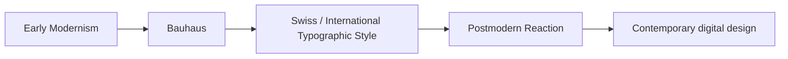

# Chapter 3: Modernism, Postmodernism, and Visual Language

Design is not only decoration. It is a way of organizing attention, establishing hierarchy, and suggesting what matters. Visual language can make a product feel clear, dependable, playful, prestigious, rebellious, or unstable. In other words, design carries ideas before a person even reads the words.

This chapter follows a simple historical path: early modernism, Bauhaus, Swiss / International Typographic Style, and the postmodern reaction. The point is not to pretend that one style replaced another cleanly. It is to see how different design traditions answered different creative and cultural questions.

## A Short Path into Modernism

Modernism grew partly from the idea that design could be systematic, rational, and useful. In the early twentieth century, designers, architects, and educators looked for ways to organize the world more clearly. They often valued function, simplicity, and standardization.

These ideas were not pure theories. They were shaped by industrialization, urban growth, and new media. The problem was not only how things looked, but how they should be made, assembled, and understood in a rapidly changing culture.

The modernist impulse often preferred:

- clear structure;
- reduced ornament;
- strong grids;
- legible type;
- visible hierarchy;
- attention to function.

This does not mean modernism was only cold or mechanical. It could also be precise, elegant, and humane. But it often sought order in the face of uncertainty.

## Bauhaus

The Bauhaus school is one of the clearest examples of modernist design thinking. It brought together art, craft, and technology. The school argued that design should respect materials, serve practical needs, and combine aesthetic judgment with technical skill.

Bauhaus thinking encouraged:

- clarity of form;
- honest use of materials;
- sensible production methods;
- integration of art and industry.

This influenced typography, product design, architecture, and visual communication. Notice the continuity between a thoughtful grid and a practical object. Both aim to reduce confusion and help people find meaning quickly.

## Swiss / International Typographic Style

The Swiss or International Typographic Style took modernist priorities and pushed them toward a highly disciplined visual system. It emphasized:

- grid structure;
- asymmetrical composition;
- strong hierarchy;
- objective, rational type treatment;
- clarity and consistency.

Designers in this tradition often stripped away emotional excess in favor of a confident, measured structure. The result could feel efficient, intellectual, and credible. It was especially influential in poster design, corporate communication, and editorial systems.

This style still matters because many digital interfaces and publishing systems owe something to it. Buttons, layouts, type scales, and grid systems often borrow from this modernist heritage.

## Modernist Principles

Modernism gave design a set of useful tools:

- **Grid:** a structure that orders content and supports alignment;
- **Hierarchy:** the idea that some information should feel more important than other information;
- **Clarity:** the aim to reduce confusion and make meaning legible;
- **Reduction:** the removal of unnecessary ornament or excess;
- **Function:** the belief that form should support purpose.

These principles still appear in contemporary design because they help teams make information understandable. A well-structured interface can reduce cognitive load and make decisions easier.

## Postmodernism as a Reaction

Postmodernism emerged partly as a reaction against modernist certainty. It questioned the idea that a single system of logic, structure, or language could capture all meaning. It often embraced:

- plurality instead of single truth;
- irony and playful contradiction;
- disruption and anti-grid layouts;
- quotation of older styles;
- expressive or deliberately unstable typography;
- a greater willingness to mix messages and references.

A postmodern design does not necessarily reject order entirely. Instead, it becomes more aware that order can feel restrictive, exclusionary, or false. It often makes visible the tension between a desire for clarity and a desire for expression.

## The Ongoing Tension

The design world has never settled into a single stable answer. Instead, it continues negotiating tensions such as:

- **order and disruption**
- **universality and identity**
- **clarity and expression**
- **grid and anti-grid**
- **restraint and abundance**
- **function and irony**

This is why contemporary digital design can contain both severe minimalism and playful chaos. A product page might use a strict grid and clean typography while also including a quirky illustration or a deliberately broken visual rhythm. A brand may try to communicate calm authority and then introduce a wink of contradiction to feel more human.

## Contemporary Design Examples

These tensions still appear in web and product design:

- a luxury brand may use a disciplined grid and quiet typography to suggest confidence, while a younger brand might use collage, motion, and asymmetry to advertise personality;
- government or educational interfaces often lean toward clarity and hierarchy for trustworthiness;
- entertainment platforms often use expressive type, layered color, and playful rhythms to invite engagement;
- design systems sometimes combine strict structure with personality-preserving overrides in order to keep a product consistent while still feeling alive.

In other words, modern growth in digital systems did not end history. It created a language that later designers learned to remix.

## How to Read a Design

When you look at a design, ask a few questions:

- What does the composition make you notice first?
- What is the hierarchy? What is less important?
- Is the layout trying to feel orderly, playful, luxurious, or unstable?
- What is the relationship between text and image?
- Does the design rely on clarity, contradiction, repetition, or interruption?
- What assumptions about the audience are being made?

Good design is rarely neutral. It is often telling you what kind of attention it wants from you.

## Museum Research

If you want to study design historically, look at authentic museum and institutional collections rather than relying on single online examples. Search for the names of museums, archives, and design collections, then verify the object or collection yourself.

Useful directions include:

- The Metropolitan Museum of Art
- Museum of Modern Art (MoMA)
- Cooper Hewitt, Smithsonian Design Museum
- Victoria and Albert Museum (V&A)
- Bauhaus archives and related institutional collections
- design departments and digital archives at major universities

Search terms to try:

- Bauhaus poster design
- Swiss graphic design poster
- modernist typography grid
- postmodern graphic design 1980s
- design language web interface history
- modernism and postmodernism design comparison

Do not treat a search result as proof of an object, style, or claim. Look for institutional context, dates, and the actual collection record before drawing conclusions.

## The Plain White T-Shirt Again

A plain white T-shirt can feel like different products depending on how it is presented.

A modernist presentation might use a strict grid, quiet typography, a centered product shot, minimal color, and an exact product story about fit, composition, and utility. The shirt feels rational, disciplined, and expertly stripped down. It reads as a durable, thoughtful basic.

A postmodern presentation might use asymmetry, collage, irregular spacing, bold type, or a deliberately ironic visual arrangement. The same shirt could feel conceptual, rebellious, expressive, or even playful in a way that questions ordinary taste. The garment becomes a cultural signal rather than a simple staple.

The shirt is the same. The visual language changes the product meaning.

## Comparison Table

| Tradition | Core idea | Typical qualities | Strength | Risk |
| --- | --- | --- | --- | --- |
| Early modernism | Order, function, clarity | Simplicity, rational structure, visible hierarchy | Improves legibility and efficiency | Can feel rigid or overly certain |
| Bauhaus | Integration of art, craft, and industry | Practical design, materials, systematic thinking | Makes design useful and coherent | Can underplay emotion or cultural nuance |
| Swiss / International Typographic Style | Precision and objective form | Grid, asymmetry, strong type hierarchy | Communicates trust and discipline | Can feel cold or impersonal |
| Postmodernism | Disruption, plurality, contradiction | Anti-grid, collage, expressive type, irony | Adapts to complexity and identity | Can feel chaotic or style-driven |

## A Design Timeline

The timeline is simplified, but it captures a common pattern: modernism focused on order and clarity; postmodernism pushed back against that certainty; contemporary design often mixes those impulses instead of choosing only one.

## What You Should Remember

Design language is a way of giving form to ideas. Modernism taught designers to prize clarity, structure, function, and order. Bauhaus and the Swiss / International Typographic Style turned those ideas into practical systems for typography and communication. Postmodernism reacted by emphasizing plurality, irony, disruption, and expression. Today, design often moves between these traditions rather than remaining inside one of them. The same plain white T-shirt can look like a disciplined essential in one presentation and a provocative statement in another. The visual system decides which story it tells.
