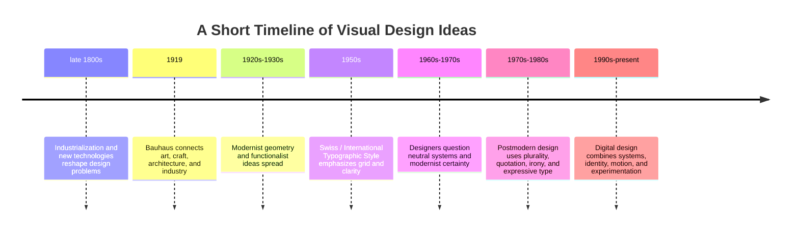

# Issue 3: Modernism, Postmodernism, and Visual Language

Visual design carries ideas. A layout, typeface, color, image, or material can make an object feel efficient, trustworthy, playful, exclusive, familiar, or strange. **Design language** is the collection of visual choices that communicates those ideas.

A plain white T-shirt shows this clearly. The shirt stays the same, but its presentation can make it seem like a universal basic, a luxury product, a political statement, or an ironic fashion object.

## A Short History of Modernism

In the late nineteenth and early twentieth centuries, industrial production, new technologies, and growing cities changed everyday life. Many artists and designers responded by looking for forms suited to this new world. They moved away from copying historical ornament and toward geometry, structure, materials, and direct communication.

This early modernist path did not produce one single style. It produced a shared interest in clarity, function, reduction, and the possibilities of modern materials and production.

### Bauhaus

The Bauhaus school, founded in 1919, connected art, craft, architecture, and industrial production. Its teaching treated design as both a creative and practical activity. Designers studied materials, construction, typography, color, and form so that visual decisions could serve everyday life.

Bauhaus-related thinking is often associated with geometric forms, reduced decoration, strong organization, and the relationship between form and function. Its influence reached furniture, architecture, graphic design, products, and education. It helped make design feel systematic and teachable.

### Swiss / International Typographic Style

In the mid-twentieth century, designers associated with the Swiss or International Typographic Style developed especially disciplined methods for graphic communication. Common features included:

- an underlying grid;
- asymmetrical composition;
- sans-serif type;
- consistent spacing and alignment;
- clear hierarchy;
- emphasis on readability and information;
- an appearance of neutral or objective communication.

The style worked well for posters, signage, corporate identity, and information systems. It expressed modernism's confidence that a clear visual system could communicate across many situations and audiences.

## Modernist Principles

Modernist design often emphasizes:

- **Grid:** a structure that organizes content and relationships.
- **Hierarchy:** a clear order that shows what to notice first.
- **Clarity:** communication that is easy to read and understand.
- **Reduction:** removing unnecessary elements so the purpose is visible.
- **Function:** making visual form support use and communication.
- **Universality:** seeking a system that can work beyond one person's taste or one local context.

These principles can produce highly usable and memorable work. They can also feel cold or overly certain when they leave little room for emotion, cultural difference, ambiguity, or individual identity.

## Postmodernism as a Reaction

Postmodernism developed partly in response to modernist certainty, restraint, universality, and order. It questioned whether one rational system could speak for everyone. It also questioned whether visual communication should always appear neutral and whether simplicity was always more honest than complexity.

Postmodern approaches often make room for:

- **plurality:** many voices and references instead of one authority;
- **irony:** a knowing distance from serious or official styles;
- **disruption:** breaking expected layouts, sequences, or rules;
- **quotation:** reusing and transforming recognizable historical or popular forms;
- **expressive typography:** treating type as an image, voice, or material;
- **layering and collage:** allowing different meanings to coexist.

Postmodernism did not simply erase modernism. Designers still use grids, hierarchy, and functional systems. The important change is that those systems can be challenged, exposed, mixed with other references, or used with humor.

## Tensions That Continue Today

Contemporary design rarely belongs completely to one historical category. Web and product designers continue to negotiate these pairs:

### Order and Disruption

A checkout flow needs predictable structure, but a brand may interrupt that structure with animation, an unexpected image, or unusual type. The disruption can create interest, but it should not hide the action the user needs to take.

### Universality and Identity

A global product may need consistent symbols and interaction patterns. At the same time, language, culture, disability, and local experience matter. A supposedly universal system may actually reflect the assumptions of the people who made it.

### Clarity and Expression

Readable labels and strong hierarchy help users act. Color, typography, imagery, and motion help a product express personality. A successful interface gives expression enough room without making meaning difficult to find.

### Grid and Anti-Grid

The grid creates alignment and rhythm. An anti-grid composition may overlap elements, use uneven spacing, or let type move across expected boundaries. Digital designers often use a grid as a stable base and break it selectively for emphasis.

### Restraint and Abundance

Sparse layouts can focus attention. Dense layouts can communicate richness, history, or energy. Both can work; the choice should match the audience, content, and purpose.

### Function and Irony

Function helps a product work. Irony can signal cultural awareness or question a familiar convention. Irony becomes a problem when the joke is more legible than the task or when it excludes people who do not share the reference.

## Plain Products, Different Meanings

Imagine the exact same plain white T-shirt shown in two product presentations.

A **modernist presentation** could use a neutral background, measured spacing, a sans-serif typeface, and a direct description of material, fit, and care. The shirt might feel universal, efficient, honest, and dependable.

A **postmodern presentation** could use collage, quotation, expressive typography, unusual cropping, or an intentionally ironic caption. The same shirt might feel like a fashion identity, a commentary on consumer culture, or a culturally specific reference.

The physical product has not changed. The visual language has changed the meaning around it.

## Comparison Table

| Approach | Main values | Common visual choices | Possible strength | Possible risk |
| --- | --- | --- | --- | --- |
| Early modernism | Function, clarity, new materials | Geometry, reduction, direct composition | Makes purpose and structure visible | Can reject useful cultural or emotional detail |
| Bauhaus | Form, craft, industry, education | Geometric form, material study, systematic practice | Connects ideas to making and everyday use | Can be simplified into a rigid formula |
| Swiss / International Typographic Style | Order, readability, objectivity | Grid, asymmetry, sans-serif type, alignment | Excellent for information and systems | Can feel impersonal or bureaucratic |
| Postmodernism | Plurality, irony, identity, disruption | Collage, quotation, expressive type, layering | Makes room for difference and complexity | Can become confusing or self-conscious |
| Contemporary hybrid | Deliberate balance | Systems combined with expressive breaks | Supports usability and personality | Requires judgment about when to follow or break rules |

## Mermaid Timeline

## How to Read a Design

Do not begin with “Do I like it?” Begin by asking what the design is asking you to notice and believe.

1. What do you see first, and how does hierarchy create that order?
2. Is there a grid? Where does the design follow it or break it?
3. What does the typography communicate about voice, authority, or emotion?
4. Does the design appear universal, or does it identify a particular audience or culture?
5. What has been reduced, and what has been made abundant?
6. Is an unusual choice functional, expressive, ironic, or all three?
7. What meanings are made possible, and which meanings are made difficult to see?

Describe evidence before making a judgment. For example, “The large sans-serif heading and repeated alignment make the page feel systematic” is more useful than “It looks modern.”

## Museum Research

Study authentic objects through museum and institutional collections rather than relying on unattributed image searches. Useful places to search include The Metropolitan Museum of Art, MoMA, Cooper Hewitt, the Victoria and Albert Museum, Bauhaus archives, university museums, and other credible public collections.

Try search terms such as:

- `Bauhaus poster collection`
- `Swiss Style poster`
- `International Typographic Style`
- `modernist graphic design collection`
- `postmodern typography collection`
- `design grid exhibition poster`
- `Bauhaus product design`

For each result, verify the institution, object title, maker or designer when available, date, medium, and catalog description. Do not invent an object, quotation, date, or URL. If a search result cannot be verified in an institutional record, describe it as an unverified lead and keep looking.

Choose one verified object and write a short visual analysis using the questions in **How to Read a Design**. Explain which values it communicates and whether it leans toward order, disruption, or a deliberate mixture.

## What You Should Remember

Modernism made grid, hierarchy, clarity, reduction, and function powerful design tools. Bauhaus connected design to materials, craft, industry, and everyday life. Swiss / International Typographic Style developed disciplined systems for readable communication. Postmodernism challenged the certainty of those systems through plurality, irony, disruption, quotation, and expressive typography.

The history is not a contest with one final winner. Contemporary web and product design still balances order and disruption, universality and identity, clarity and expression, grid and anti-grid, restraint and abundance, and function and irony. Designers communicate ideas whenever they choose how something should be seen.
