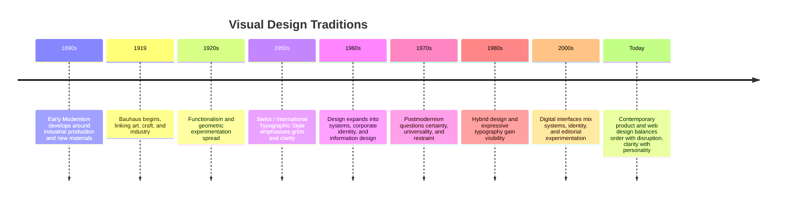

# Chapter 3: Design Language and the Meaning of Visual Form

Visual design is not decoration added after the real work is done. It is a way of organizing attention, shaping meaning, and helping people understand what a product, page, or object is for. A design language is a set of visual choices that communicate values: order, emotion, trust, novelty, seriousness, or play.

Even a plain white T-shirt can communicate very different ideas depending on how it is presented. The shirt has the same physical form, but a modernist presentation might make it feel precise, universal, and efficient. A postmodern presentation might make it feel ironic, expressive, or culturally loaded. Design is one of the ways an object becomes a product, a symbol, or a statement.

## From Early Modernism to Visual Systems

The story of modern visual design begins in the late nineteenth and early twentieth centuries, when many designers and artists wanted to respond to industrialization, technological change, and the growing speed of urban life. They were not trying to create a single universal style for all time. Instead, they were trying to find clear, rational, and useful forms for a changing world.

### Early Modernism

Early modernism valued clarity, honesty, and direct communication. Designers often rejected excessive ornament and historical imitation. They wanted forms that could be understood quickly and used efficiently. A strong idea of function was central: design should help a person use something without confusion.

This period also included a sense that new technology and new materials would allow more disciplined design. The modernist impulse often favored simple geometry, precise typesetting, strong contrast, and disciplined composition. These choices can make a design feel confident, stable, and controlled.

### Bauhaus

The Bauhaus is a major reference point in the story of modern design because it brought together art, craft, architecture, and industrial production. It treated design as a problem of form, function, and social purpose. It did not treat art and design as separate worlds. The goal was to connect visual thinking to everyday life.

The Bauhaus is often associated with:

- reduced form;
- geometric structure;
- grid-based organization;
- strong hierarchy;
- a belief that good design can improve ordinary life;
- an effort to make design more systematic and teachable.

Bauhaus thinking had a powerful effect on graphic design, architecture, furniture, and industrial objects. It shaped a large part of twentieth-century design culture. But it also created a highly influential model of order, control, and visual certainty.

### Swiss / International Typographic Style

Later, especially in the mid-twentieth century, designers in Switzerland developed a particularly disciplined graphic system that became widely known as the Swiss Style or the International Typographic Style. This approach emphasized:

- asymmetrical layout;
- strict grid structure;
- clear hierarchy;
- sans-serif typography;
- objective, neutral communication;
- strong spacing and alignment;
- a belief that clarity and readability were central design values.

This style became associated with corporate identity, posters, signage, and systems for information design. It was deeply modernist in its commitment to order and rational communication. It also carries a strong faith in universality: if a system is clear enough, it should work across many contexts and many audiences.

## Modernism's Core Principles

Modernist design often emphasizes a few recurring ideas:

- **Grid:** a structure that organizes content and keeps relationships consistent.
- **Hierarchy:** order of importance that helps the viewer understand what matters first.
- **Clarity:** communication should be easy to read, efficient, and not cluttered.
- **Reduction:** unnecessary decoration is removed so form serves function.
- **Function:** design should support the practical and communicative purpose of the object.
- **Objectivity:** the visual system tries to feel neutral, rational, and universal.

These principles can produce elegant and highly usable work. They can also create a design language that feels overly certain, emotionally restricted, or detached from cultural difference and personal expression.

## Postmodernism as a Reaction

Postmodernism emerged partly as a reaction against modernist certainty. It questioned the idea that one visual system could speak for everyone. It also challenged the belief that restraint, order, and universal logic were always the best or most honest answer.

Postmodern design often embraced:

- plurality rather than single authority;
- irony rather than pure seriousness;
- quotation rather than originality in the narrow sense;
- disruption of the grid;
- expressive or playful typography;
- layering, collage, and mixed references;
- a sense that communication can be ambiguous, culturally specific, or emotionally charged.

This is not the same as saying modernism was bad or that postmodernism replaced it completely. The relationship is more nuanced. Postmodernism partly emerged because some designers felt modernism had become too rigid, too universal, too confident, and too focused on order at the expense of human complexity.

## The Ongoing Tension

The most important idea in visual design is not that one period “wins.” It is that design keeps negotiating tensions between competing values.

### Order and Disruption

Modernist design seeks control, alignment, and legibility. Postmodern design may break symmetry, layer unexpected elements, or introduce visual noise to challenge authority and predictability. Yet many contemporary designs borrow from both. A product website may use a strict grid for structure while adding a playful or surprising visual accent.

### Universality and Identity

Modernism often aims for a system that can work broadly and communicate clearly across many contexts. Postmodern design often highlights cultural identity, specificity, and difference. Contemporary design frequently mixes the two: a brand may use a clear global system while also creating distinct local expressions or culturally resonant details.

### Clarity and Expression

A good interface should be easy to understand, but it can also express personality, emotion, or taste. Designers are constantly balancing readability with character. A system that is too cold can feel sterile; one that is too expressive can become confusing.

### Grid and Anti-Grid

The grid is one of modern design's key tools. It organizes content and creates rhythm. Anti-grid strategies may reject strict alignment, create asymmetry, or allow content to drift in ways that feel more spontaneous. Many contemporary systems do not pick one side entirely; they use the grid as a base and then break it in selective, purposeful ways.

### Restraint and Abundance

Modernist design may favor simplicity and controlled visual density. Postmodern design often intentionally adds references, textures, collage, or overload. Contemporary web and product design often uses a measured mix: restrained navigation with expressive imagery, or sparse layouts with rich content layers.

### Function and Irony

A design can aim to make a task easy and direct. It can also signal cultural awareness by making a joke, using an unexpected reference, or playing with the idea of a product as a symbol. Irony can be thoughtful, but it can also be empty if it only imitates rebellion without clarifying the product's purpose or value.

## Design Language in Contemporary Digital Products

The history of design does not end with one final style. Contemporary web and product design continues to borrow from many traditions at once.

A modern interface might rely on:

- strong hierarchy;
- whitespace and alignment;
- clean typography;
- clear labels and navigation;
- modular grids;
- a system of consistent components.

A postmodern or hybrid interface might add:

- expressive type choices;
- off-grid composition;
- playful color or contrast;
- layered visual references;
- editorial layouts that break the usual patterns;
- custom illustrations or visible personality.

This mixture is especially visible in digital design. Many branding systems use disciplined grids and reusable components while also shaping a distinctive visual personality. Many product pages use minimalist layouts and then interrupt that calm with motion, humor, or striking editorial typography. The result is not a simple return to “old” or “new.” It is a continuing negotiation between order and expression.

## Comparison Table

| Design approach | Typical values | Visual language | Strengths | Risks |
| --- | --- | --- | --- | --- |
| Early modernism | Function, clarity, honesty, efficiency | Simple geometry, strong hierarchy, disciplined composition | Clear communication, usable systems, emphasis on purpose | Can feel cold, rigid, or over-standardized |
| Bauhaus | Form follows function, social purpose, craft and industry | Modular systems, reduced forms, rational layouts | Strong teaching model, direct design thinking, broad influence | Can become rigid or overly universal |
| Swiss / International Typographic Style | Objectivity, readability, order, universality | Grid, sans-serif type, asymmetry, systematic spacing | Excellent information design, consistency, legibility | Can feel impersonal or bureaucratic |
| Postmodernism | Plurality, irony, expression, disruption | Layering, collage, quotation, expressive typography | Reflects complexity, identity, cultural nuance | Can become chaotic, self-conscious, or unclear |
| Contemporary hybrid design | Balance, systems + personality | Structured layouts with expressive accents and selective breaks | Flexible, adaptable, memorable, modern | Requires judgment so the mix does not become inconsistent |

## Mermaid Timeline

## How to Read a Design

Learning to read a design means noticing more than what looks attractive. It means asking how the visual choices create meaning.

Ask questions such as:

- What is the first thing I notice?
- What is the hierarchy of information?
- Is the layout based on a grid or does it break away from it?
- Is the design trying to feel precise, neutral, playful, nostalgic, or rebellious?
- What values does the typography suggest: seriousness, calm, personality, urgency, or irony?
- Does the design seem universal or specific to a culture, audience, or moment?
- What is being emphasized and what is being hidden?
- Does the design try to feel objective, or does it openly acknowledge its own point of view?

A strong design is often readable on multiple levels. At the surface, it may look modern or fashionable. At a deeper level, it may communicate a worldview. To read a design well, you must learn to notice both its immediate appearance and the values beneath it.

## Museum Research

A good way to study design history is to look at real objects and systems from museum and institutional collections. These collections often show how visual ideas developed in fashion, typography, posters, architecture, products, and exhibitions.

Use search terms such as:

- Bauhaus poster
- Swiss poster design
- International Typographic Style
- modernist graphic design
- postmodern graphic design
- industrial design modernism
- design system grid
- exhibition design modernism
- typography museum collection
- poster design collection

Search for authentic examples in credible collections such as:

- The Metropolitan Museum of Art
- The Museum of Modern Art (MoMA)
- Cooper Hewitt, Smithsonian Design Museum
- Victoria and Albert Museum (V&A)
- Bauhaus archives and related institutional collections
- university art and design museum collections
- public museum collections with catalog records and object information

Important: do not assume that every search result is accurate or complete. Verify the object, collection, date, institution, and description yourself. A museum or archive catalog is more trustworthy than a random image repost. The job is not to copy a style; it is to study how designers used ideas and systems in real historical contexts.

## The White T-Shirt Again

A plain white T-shirt is a useful object for thinking about design language because it is simple, familiar, and easy to present in many ways.

A **modernist presentation** might photograph the shirt on a plain background, use a clear sans-serif type treatment, keep the composition neat and disciplined, and emphasize function, simplicity, and reliability. The shirt feels like a standardized essential: useful, clean, universal, and efficient.

A **postmodern presentation** might use collage, expressive typography, a more provocative composition, mixed references, or an intentionally ironic framing. The exact same shirt could feel like a cultural statement, a fashion object, or a critique of purity and consumer neutrality. It becomes less like a neutral basic and more like a designed identity or performance.

The object did not change. The design language did.

## What You Should Remember

Visual design carries ideas as much as it carries information. Modernism taught designers to value order, clarity, hierarchy, and function. Bauhaus ideas and the Swiss / International Typographic Style made these principles powerful and widely influential. Postmodernism reacted against the certainty and universality of that model by emphasizing disruption, irony, identity, plurality, and expressive form.

The real lesson is not that one style replaced another. The real lesson is that design is always negotiating tensions: order and disruption, universality and identity, clarity and expression, grid and anti-grid, restraint and abundance, function and irony. Contemporary digital design continues this negotiation every day. Good designers do not pretend that history ended with one perfect system. They learn from history, understand the trade-offs, and choose visual language with intention.
