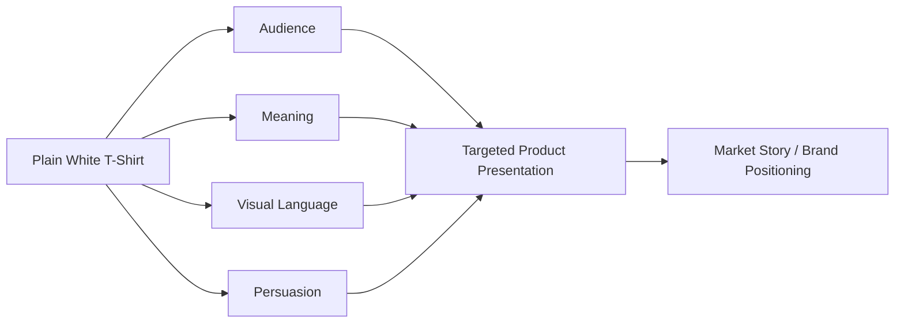

# Chapter 4: The Plain White T-Shirt Case Study

A plain white T-shirt is one of the best objects for learning how design shapes meaning. The physical garment can be almost identical in every version, yet the story around it can change completely. A shirt is not just a shirt. It is a promise about identity, taste, status, comfort, values, and lifestyle.

This is the heart of product presentation: the same object can be sold as a useful basic, a luxury staple, a cultural symbol, a rebellious statement, or an explorer's essential. Designers do not invent the shirt from scratch. They build a context around it. They decide which meaning customers are invited to buy.

## The Same Shirt, Different Stories

The ordinary high-quality white T-shirt is a useful case study because it sits between utility and symbolism. It is familiar enough to feel safe, but flexible enough to carry many different meanings. It can be positioned as:

- an essential for everyday life;
- a minimalist design object;
- a brand statement;
- a wearable identity;
- a rebellious anti-fashion item;
- a premium uniform for a particular kind of person.

When the product remains nearly the same, the difference comes from audience, archetype, persuasion, and visual language.

## Concept 1: The Minimal Essential

### Audience
Adults who want clean, reliable basics with a premium feel.

### Brand archetype
The Caregiver or Everyperson.

### Persuasive principles
- clarity and trust;
- social proof through quality and simplicity;
- authority through material honesty;
- commitment and consistency through “buy the essentials that last.”

### Visual-design language
Restrained modernist / Swiss-influenced design.

### Headline
“Made to be worn. Designed to be trusted.”

### Short product story
This shirt is the dependable layer that supports a life without drama. It is cut for comfort, built to last, and styled with a disciplined visual language. The product story invites the customer to buy reliability, practicality, and quiet confidence.

### Imagery direction
Photographs on a plain light background. Crisp product shot. Strong negative space. Limited color palette. Type that feels precise, modern, and quiet. No clutter, no noise, no excessive lifestyle fantasy.

### What meaning the customer is being invited to buy
The customer is buying a rational, useful, trustworthy identity: someone who values quality, function, simplicity, and careful standards.

### Ethical concern or possible misuse
This approach can become manipulative if it presents “simple” as morally superior while hiding actual quality problems, labor issues, or exaggerated durability claims. The design language can look honest while still creating emotional pressure toward a “better self” narrative.

## Concept 2: The Explorer

### Audience
People who want travel, movement, independence, and a wardrobe that feels practical but adventurous.

### Brand archetype
The Explorer.

### Persuasive principles
- identity and belonging;
- narrative transportation;
- social proof through lifestyle cues;
- scarcity if the item is framed as a limited field edition.

### Visual-design language
Climactic, documentary, tactile, slightly rugged.

### Headline
“Worn where the map ends.”

### Short product story
This T-shirt is not just a shirt; it is part of a life built around movement, curiosity, and endurance. It tells a story of trails, cities, weather, and improvisation. It invites the customer to imagine themselves as someone who is capable, ready, and always a little bit outside the ordinary.

### Imagery direction
Earth tones, road textures, weathered surfaces, travel photography, maps, worn leather, open landscapes, and a slightly lived-in feel. The shirt appears in motion rather than in a sterile studio.

### What meaning the customer is being invited to buy
The customer is buying the experience of independence, competence, and adventure. The shirt becomes a visible sign of someone who moves through the world with curiosity rather than comfort alone.

### Ethical concern or possible misuse
This can slide into romanticized “authenticity” without enough evidence. A company may sell an explorer identity while selling a product that is still just a T-shirt. The risk is pretending the shirt is a passport to a life of freedom when it is primarily a consumer object.

## Concept 3: The Cultural Commentator

### Audience
Young adults, design students, creative workers, and people who enjoy idea-driven fashion.

### Brand archetype
The Creator or Rebel.

### Persuasive principles
- liking and identity;
- social proof through cultural relevance;
- scarcity and novelty;
- authority through taste and cultural fluency.

### Visual-design language
Disruptive or postmodern. Layered text, collage, editorial composition, mixed references, and a playful refusal of neatness.

### Headline
“Not a uniform. A statement with a seam.”

### Short product story
This is a shirt for people who do not want the brand to look like a safe corporate standard. It embraces contradiction, wit, and cultural references. The product is part clothing, part commentary, part visual provocation.

### Imagery direction
Bold typography, asymmetrical layout, clipping, grain, collage, unusual color blocks, a sense of visual tension, and references that feel intentionally assembled rather than polished. It should feel editorial and self-aware.

### What meaning the customer is being invited to buy
The customer is buying a sense of cultural intelligence and personal difference. They are not just wearing clothing; they are signaling that they notice the joke, the system, and the contradiction.

### Ethical concern or possible misuse
This style can become an empty performance of rebellion. If the shirt is only carrying irony without substance, the customer may feel sold an attitude rather than a product. If the message is too clever, it may alienate people who want clarity instead of commentary.

## Concept 4: The Luxury Standard

### Audience
Professionals, style-conscious consumers, and people who want clothing that feels elevated, intentional, and status-coded.

### Brand archetype
The Ruler or the Sage.

### Persuasive principles
- authority through material and craft claims;
- scarcity and premium pricing;
- social proof through status signals;
- framing, because the shirt is presented as “less but better.”

### Visual-design language
Minimalist luxury. High contrast. Editorial luxury photography. Carefully controlled composition. Calm confidence.

### Headline
“Quietly expensive. Unapologetically essential.”

### Short product story
This T-shirt is presented as an object of restraint and deliberate craftsmanship. It is simple, expensive, and highly controlled. The story makes the shirt feel like a premium signal of taste and discernment rather than merely a basic garment.

### Imagery direction
Museum-like stillness, soft controlled lighting, premium studio setup, generous negative space, fine fabrics, and exacting composition. The shirt is framed as an object of quality and self-command.

### What meaning the customer is being invited to buy
The customer is buying taste, judgment, and social distinction. The shirt becomes a marker of elite restraint: not loud, not trendy, but carefully selected.

### Ethical concern or possible misuse
This approach can exploit status anxiety. It may make a simple product feel superior because the price and styling imply meaning, not because the garment is truly different in function. It risks turning luxury into a performance of worth rather than a reflection of actual quality.

## A Synthesis Table

| Concept | Target audience | Archetype | Persuasion principles | Visual language | Meaning being sold | Ethical risk |
| --- | --- | --- | --- | --- | --- | --- |
| Minimal Essential | Practical, quality-conscious adults | Caregiver / Everyperson | Clarity, trust, authority, consistency | Restrained modernist / Swiss-inspired | Reliability, simplicity, good standards | “Simple” can be used to hide weak quality or overclaiming |
| Explorer | Travel-minded, independent consumers | Explorer | Identity, narrative, social proof, scarcity | Documentary, rugged, tactile | Adventure, freedom, preparedness | Romanticized authenticity can hide market motives |
| Cultural Commentator | Students, creatives, taste-makers | Creator / Rebel | Identity, social proof, scarcity, cultural relevance | Disruptive, postmodern, editorial | Difference, wit, cultural intelligence | Irony can become style without substance |
| Luxury Standard | Status-conscious professionals | Ruler / Sage | Authority, scarcity, status, framing | Minimalist luxury | Taste, judgment, exclusivity | Premium framing can exploit status anxiety |

## How the Same Product Becomes Different Markets

The physical shirt is the same, but the product presentation changes every part of the relationship between customer and object.

The product's meaning is shaped by at least five things working together:

1. the audience being addressed;
2. the archetype guiding the story;
3. the persuasive principles in use;
4. the visual design language;
5. the cultural meaning the company wants the customer to adopt.

This is why a T-shirt can be sold as “basic,” “adventurous,” “ironic,” or “luxury” without changing the garment itself. The shirt is only one layer of the presentation. The rest is narrative design.

## Mermaid Diagram

## Why This Matters

The same shirt can be sold to different customers by changing the meaning being invited. A brand does not merely sell the garment. It sells a role, a worldview, and a mode of self-expression. Good persuasion is never neutral; it always invites the customer to imagine themselves in a certain identity.

That is why design language matters. The visual system does not just decorate the shirt. It signals whether the product feels practical, rebellious, premium, authentic, or cosmopolitan. A persuasive presentation can be thoughtful and useful, or it can be misleading, manipulative, or culturally empty.

## What You Should Remember

The plain white T-shirt is a perfect case study because it shows how design, persuasion, and identity work together. The physical object may stay nearly the same, but the meaning changes dramatically depending on audience, archetype, narrative, and visual language. A modernist presentation may make the shirt feel useful and universal; a disruptive postmodern presentation may make it feel like a cultural statement; a luxury framing may make it feel exclusive; and an explorer framing may make it feel adventurous and self-reliant.

The key lesson is that products are not only made of fabric, thread, and cut. They are made of stories, signals, expectations, and values. The designer's job is not to hide that reality. It is to make it visible, deliberate, and ethically accountable.
