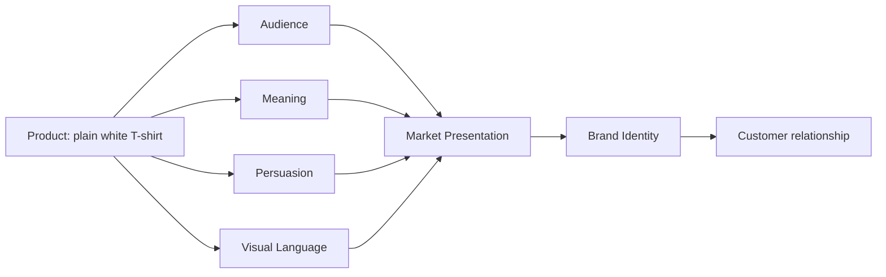

# Chapter 4: The Plain White T-Shirt Case Study

The plain white T-shirt is a useful test object because it is ordinary enough to feel familiar and flexible enough to carry many meanings. The same shirt can be sold as a tool for movement, an emblem of disciplined restraint, a luxury purchase, or an ironic statement against luxury. The product stays mostly the same. The presentation changes the promise.

This chapter brings together three ideas from earlier chapters: persuasion, archetypes, and design language. The question is not simply, “What is this shirt?” but “What is this shirt asking its buyer to become?”

## The Baseline Product

The physical product is a high-quality plain white T-shirt.

It has:

- a simple silhouette;
- a neutral color that is easy to match to other clothing;
- a familiar social role as a basic garment;
- enough flexibility to support many kinds of meaning.

A designer can emphasize utility, nostalgia, identity, status, craft, or anti-status. The shirt itself does not dictate any one story. That is where the marketing and visual language do their work.

## Concept 1: The Explorer

### Positioning

**Audience:** students, travelers, and weekend explorers who want a shirt that feels ready for movement and variability.

**Brand archetype:** Explorer

**Persuasive principles:** utility, autonomy, scarcity, social proof, framing

**Visual language:** clear, practical, outdoorsy, slightly rugged; strong photography of movement; a restrained palette with earthy neutrals and sunlight tones.

**Headline:** “Built for the road, the trail, and the unexpected.”

**Short product story:** This shirt is for people who do not want to plan every detail of their day. It is a dependable layer for walking, commuting, training, or leaving the city on a whim. The line is not about looking fashionable at an event; it is about feeling ready when plans change.

**Likely imagery:** a shirt on a person walking through a road, a train platform, a riverbank, or a city edge; motion blur or a natural setting; practical details such as fit, weight, and layering.

**Meaning being sold:** “You can handle variability without clutter or performance anxiety.”

**Ethical concern:** A rugged image may hide the fact that the product is still a basic garment. If the brand overstates durability or performance, the imagery may become misleading rather than inspiring.

## Concept 2: The Modernist Essential

### Positioning

**Audience:** design-minded consumers who value clarity, discipline, and restraint.

**Brand archetype:** Sage and sometimes Ruler, depending on how much authority the brand wants to claim.

**Persuasive principles:** authority, clarity, commitment and consistency, framing

**Visual language:** modernist, Swiss-inspired, grid-based, high contrast, minimal typography, generous white space, careful hierarchy.

**Headline:** “One excellent shirt. Thoughtfully made.”

**Short product story:** The shirt is presented as a piece of considered design. It is not about excess, statement, or trend. It is about quality and the value of doing a basic thing well. This is a clean product, intentionally narrow in meaning but strong in character.

**Likely imagery:** centered product shot on a white or near-white background, exact crop, precise lighting, minimal props, thin typography, simple annotation of fabric and cut, perhaps a measured grid or architectural composition.

**Meaning being sold:** “You are a person who values clarity, control, and good judgment.”

**Ethical concern:** A restrained, authoritative look can feel superior or exclusionary. It may also encourage a false belief that minimalism is automatically better or more truthful than other visual styles.

## Concept 3: The Postmodern Disruptor

### Positioning

**Audience:** creative young adults, students, and culture consumers who enjoy irony, experimentation, and visible difference.

**Brand archetype:** Rebel, Jester, and sometimes Magician

**Persuasive principles:** social proof, identity signaling, scarcity, contrast, novelty

**Visual language:** disruptive, postmodern, collage-like, loud type, asymmetry, visual tension, hand-drawn overlays, mixed textures, off-register colors, or a deliberately broken grid.

**Headline:** “Not a uniform. A disruption.”

**Short product story:** This shirt refuses the idea that clothing must be quiet or conformist. It presents itself as an object that can challenge taste, interrupt expectation, and turn a plain undershirt into a cultural signal. The shirt becomes an attitude rather than just a layer.

**Likely imagery:** exaggerated composition, layered graphics, unexpected color blocks, distorted proportions, collaged type, textures that suggest printing errors or rebellious editing. The shirt may be photographed in a setting that feels too controlled or absurdly overdesigned.

**Meaning being sold:** “You are willing to appear different, to reject polish, and to turn ordinary life into a performance of insight or irony.”

**Ethical concern:** The disruptive style can rely on attention-grabbing shock rather than meaningful differentiation. It risks making the shirt a status marker for those who can carry visual noise without being seen as chaotic or unserious.

## Concept 4: The Luxury Signal

### Positioning

**Audience:** consumers who want a garment that reads as premium, elevated, and socially legible.

**Brand archetype:** Lover, Ruler, or Magician depending on how the brand frames value and exclusivity.

**Persuasive principles:** authority, scarcity, status signaling, liking, framing

**Visual language:** high-end editorial, premium materials, rich texture, elegant typography, quiet luxury, subtle details, careful staging.

**Headline:** “The shirt that does not need to shout.”

**Short product story:** The shirt is positioned as refined and rare, not because it is loud, but because it signals taste and an ability to choose something better than the ordinary. The brand sells a comfortable sense of status through precision, material quality, and understated confidence.

**Likely imagery:** soft studio lighting, close product close-ups, textures that look expensive, slow camera motion, polished environment, perhaps an elevated neutral palette and limited-run language. The lighting should feel luxurious without becoming excessive.

**Meaning being sold:** “You have developed an eye for what holds value, and you can afford to signal that discretion.”

**Ethical concern:** This strategy can rely on social comparison and aspiration. It may invite people to buy a feeling of status rather than a genuine material benefit, especially when the underlying shirt remains ordinary in function.

## Synthesis Table

| Concept | Audience | Archetype | Persuasive principles | Visual language | Meaning being sold | Ethical risk |
| --- | --- | --- | --- | --- | --- | --- |
| Explorer | Travelers, students, active people | Explorer | Utility, autonomy, social proof, scarcity | Practical, outdoorsy, move-oriented | You are ready for whatever happens | Overstating durability or making the shirt seem more rugged than it is |
| Modernist Essential | Design-aware consumers | Sage / Ruler | Authority, clarity, consistency, framing | Swiss-inspired, minimal, disciplined | You value quality and clear judgment | Can become elitist or falsely equate minimalism with truth |
| Postmodern Disruptor | Creative culture consumers | Rebel / Jester / Magician | Contrast, scarcity, identity signaling, novelty | Collage, off-grid, loud, asymmetric | You can disrupt expectations and express difference | Can become attention-seeking rather than meaningful |
| Luxury Signal | Aspiration-driven buyers | Lover / Ruler / Magician | Scarcity, framing, status signaling, authority | Premium editorial, quiet luxury | You have taste and can afford distinction | Can encourage status anxiety or sell a feeling instead of a product |

## How the Elements Combine

The important point is that no single element solves the entire problem. A shirt becomes a product presentation only when product, audience, meaning, persuasion, and visual language fit together. If the visual language says “minimal luxury” but the message says “anti-status rebellion,” the customer experiences dissonance. A coherent presentation is not necessarily a morally perfect one, but it is more likely to be honest and easier to understand.

## Why This Matters

The plain white T-shirt is compelling because it is almost empty as a symbol. That emptiness gives marketing room. A brand can fill it with ordinary utility, clarity, status, irony, autonomy, or craft. This is useful because it shows that design is not only about adding features. It is also about deciding what kind of meaning is worth carrying.

A student learning design should notice how each concept does not change the shirt's material reality very much. Instead, it changes the customer story around it. That is the central job of persuasion, branding, and design language: to guide attention toward a specific interpretation without pretending the object itself has mysteriously become different.

## What You Should Remember

A plain white T-shirt is a blank but not neutral canvas. Different audiences hear different promises in the same garment. The same shirt can be sold as a practical tool, a disciplined essential, a rebellious statement, or a luxury signal depending on the archetype, persuasive strategy, and visual language used around it. The deeper lesson is that a product presentation is a system. Product, audience, meaning, persuasion, and design language must agree if the customer is to feel a clear and credible promise.
