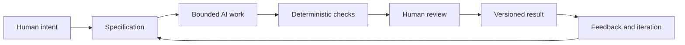

# Chapter 5: Synthesis — Persuasion, Archetypes, and Design Language in AI-Assisted Work

The earlier chapters each focused on a different lens:

- persuasion helps explain what response we want to enable;
- archetypes help explain what meaning or identity we want a product or message to carry;
- design language helps explain how that meaning should look, feel, and be experienced.

Taken together, these three lenses form a useful control framework for creative and technical work. They help a person decide not just what to produce, but why it should be produced, what it should mean, and how it should be shaped for a real audience.

This matters even more when AI is involved.

An AI system can generate text, layout drafts, code, visual concepts, and alternative directions very quickly, but it does not automatically know the difference between a useful answer and a convincing but wrong answer. A bounded creative process is needed.

## A Working Framework

### Persuasion: What Response Are We Trying to Enable?

Persuasion is not just sales language. It is a way of thinking about attention, interpretation, trust, and action. A good design or communication task should be clear about the desired response: inform, reassure, persuade, invite, confirm, or direct.

If a task is to write a product description, the response might be to help the reader feel confident enough to compare options or proceed to the next step. If a task is to write a lesson overview, the response might be to clarify a concept and reduce friction for learning.

### Archetype: What Meaning or Identity Are We Expressing?

Archetypes give a brand, product, or experience a recognizable emotional role. A brand can be a Explorer, Sage, Rebel, Caregiver, or any number of other patterns. The point is not to reduce a person to a type. It is to anchor meaning so that the output has a clear attitude.

When a design team chooses an archetype, it asks: "What role do we want the audience to feel we are playing?" This helps keep the tone coherent, whether the work is visual, written, or interactive.

### Design Language: How Should That Meaning Look and Feel?

Good design language gives the chosen meaning a visible structure. It covers typography, spacing, rhythm, imagery, color, motion, pacing, composition, and the overall communication mood. A modernist design language will feel different from a postmodern or luxury editorial one, even if the underlying product is the same.

This is where persuasion and archetype become visible. The message is not just what is said; it is how it looks, what it emphasizes, and what it leaves out.

## Why AI Work Needs a Specification

A generative system is highly capable, but it can also drift. Without a clear specification, a model may satisfy a vague request in a way that is attractive but not useful. A specification sets boundaries.

A strong specification should answer several questions:

- What is the task?
- Who is the audience?
- What outcome should be achieved?
- What constraints matter?
- What does success look like?
- What counts as failure or wrong?

This matters because a model is not a mind reading machine. It works from patterns and instructions. Clear boundaries reduce ambiguity, lower revision cycles, and make the process easier to evaluate.

A specification is not the same thing as a command to suppress creativity. It is a way to create a useful creative frame. A good brief is specific enough to direct the system but flexible enough to allow real thinking.

## Deterministic Checks, Probabilistic Review, and Human Judgment

Not all validation is the same.

### Deterministic checks

Deterministic checks are rules that can be verified reliably. Examples include whether a file exists, whether a heading matches a required label, whether a markdown table has the expected columns, whether the Mermaid diagram syntax parses, or whether a build command completes without failure.

These checks are useful because they are cheap, repeatable, and easy to automate. They do not decide whether a piece is good; they decide whether it meets a defined standard.

### Probabilistic review

AI review can be useful because it can scan for missing sections, weak logic, tone problems, or likely inconsistencies. But AI review is probabilistic. It is pattern-based, not guaranteed. It can miss nuanced problems, confuse tone with substance, or produce confident nonsense.

This means AI review should function as a second opinion, not as the final authority. It is helpful to catch obvious issues quickly, then a human can decide whether the output meaningfully meets the purpose.

### Human judgment

Humans remain responsible for judgment, meaning, truthfulness, and final decisions. A designer or author must decide:

- whether the content is appropriate to the audience;
- whether the product claim is fair and supportable;
- whether the tone truly fits the intended brand or situation;
- whether the design is culturally sensitive and ethically responsible;
- whether the final result is the right one for the actual context.

This is where the earlier concepts matter. Persuasion can help design an intended response. Archetypes can ground the emotional meaning. Design language can shape the expression. But the final authority still rests with the person who owns the decisions and its consequences.

## Why Version Control Matters

When AI is generating work, version control is essential. Git gives a project traceability and recovery. It lets a person see exactly what changed, when it changed, and which version was used for a particular decision. If a draft becomes confusing, misleading, or worse, the project can return to an earlier state.

Version control is a practical form of accountability. It allows teams to compare iterations, review messages, and detect whether a change introduced a new issue. A design project without revision history is harder to understand and harder to trust, especially when multiple people or AI systems are working on the same artifact.

This is not just about technical neatness. It is about the discipline of making creative work reviewable. If a product claim changes, the rationale should be traceable. If a section is rewritten, the project should know why. If a generated concept drifts from the specification, the team should be able to detect that drift quickly.

## The Pit-Stop Metaphor

Think of a race-car pit stop. The car keeps moving, but the pit crew does not stop the entire race to inspect everything. Instead, they make strategic interventions at precise moments: tire pressure, fuel efficiency, wheel alignment, and the final check before the car returns to the track.

The same logic applies to AI-assisted work. Automation can keep running quickly and cheaply across many checks. But selected moments deserve human inspection: the specification, the final wording, the ethical framing, the evidence behind claims, and the final decision to publish or ship.

That is deliberate human review: not slow, broad, and frequent in every step, but thoughtful and timed to where the stakes matter most.

## The Complete Workflow

This workflow is not about slowing the process down for no reason. It is about making sure the machine's speed does not outrun the human's responsibility. A clear specification narrows the task. Deterministic checks catch obvious errors cheaply. Human review catches issues that need context, meaning, and judgment. Version control preserves the history so the team can recover and improve the work without losing the trail.

## Why This Book Matters

These three lenses—persuasion, archetype, and design language—are not just about branding or advertising. They are practical ways of understanding how communication creates meaning and how design choices shape action. When connected to disciplined AI workflows, they become part of a larger system that helps teams direct creative and technical work responsibly.

The goal is not machine obedience. The goal is better human direction.

## Questions for Next Week

- What kinds of AI tasks in your own work would benefit from a tighter specification?
- Which parts of a project should be reviewed by deterministic checks, and which need human interpretation?
- How could a brand archetype and visual language help you shape a better AI prompt?
- When does a persuasive design strategy become manipulative rather than helpful?
- What would your process look like if every AI-generated draft was versioned and reviewable?

## What You Should Remember

Persuasion, archetype, and design language work together as a framework for deciding what a communication effort should do, what meaning it should carry, and how it should look. When combined with clear specifications, deterministic checks, AI-assisted review, and version control, this framework becomes a practical method for directing creative work responsibly. The main lesson is simple: technology can accelerate output, but human judgment remains the final source of meaning, honesty, and consequence.
