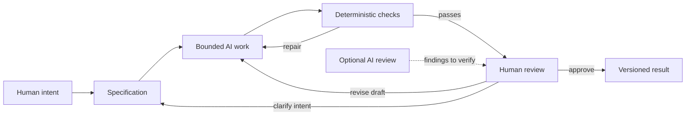

# Chapter 5: From Creative Intent to Reviewable Work

The earlier chapters examined the same basic problem from different angles: how can a message make a difference without losing its honesty or its sense of purpose? Persuasion, archetypes, and design language are useful together because each answers a different question.

## Three Lenses, Three Decisions

| Lens | Question | Decision it helps make |
| --- | --- | --- |
| Persuasion | What response are we trying to enable? | Whether the audience should notice, understand, compare, try, or decide |
| Archetype | What meaning or identity are we expressing? | Whether the work feels like a guide, explorer, rebel, caretaker, or another recognizable role |
| Design language | How should that meaning look and feel? | Whether form should be orderly, expressive, restrained, layered, or some deliberate combination |

These lenses are not three coats of paint applied at the end. They are three checks on the direction of the work. A campaign for a plain white T-shirt might ask people to compare materials before buying, express a Sage identity, and use a calm information system. A different campaign might invite experimentation, express an Explorer identity, and use an energetic editorial composition. The shirt can stay the same while the intended response, identity, and visual form change.

The lenses also help direct AI. Instead of asking an AI system to “make it more interesting,” give it decisions it can work with: the response to enable, the identity to express, the visual rules to follow, and the claims it must not invent. A good direction leaves room for alternatives while making the important boundaries visible.

## Start with a Specification

A **specification** turns intent into a bounded, reviewable assignment. It should name the audience, desired response, meaning, format, required content, fixed facts, allowed files, and acceptance criteria. It should also identify what is unknown. An unknown fact is not an invitation for AI to guess.

For example:

> Write one Markdown concept for students choosing an everyday white T-shirt. Help readers compare fit and care information before deciding. Use a Sage-like tone without claiming that the audience is uninformed. Use clear hierarchy and restrained typography in the visual direction. Keep the supplied product facts unchanged. Label fictional copy, and do not invent reviews, performance claims, environmental benefits, or sources. Change only the requested chapter file.

This specification gives AI a useful creative problem and a set of limits. It also gives a reviewer something concrete to inspect. The same principle applies to technical work: a request for a size selector should describe unavailable sizes, keyboard behavior, and the files that may change, not merely say “make the interface better.”

## Give AI a Bounded Job

AI is good at producing options, reorganizing material, and pointing out possible inconsistencies. Those abilities become more useful when the task is small enough to inspect. Divide a large project into named outputs, and keep the inputs visible.

Before asking for a change, identify:

- **Inputs:** the brief, existing files, verified facts, and relevant references.
- **Allowed work:** the exact output and the kinds of edits permitted.
- **Evidence of completion:** required headings, links, tests, or other acceptance checks.
- **Open questions:** decisions that require research or a person's judgment.

Boundaries protect authorship as well as quality. If the task is to revise one chapter, the instruction does not automatically authorize a new navigation system or edits to every other chapter. A focused change produces a focused diff.

## Four Ways to Evaluate a Result

Review is stronger when each method is used for the question it can actually answer.

| Method | What it can ask | Example | What it cannot guarantee |
| --- | --- | --- | --- |
| Deterministic check | Does a defined rule pass? | Is the required file present, nonempty, and linked correctly? | That the explanation is true or worthwhile |
| Probabilistic AI review | What possible weakness deserves attention? | Does a sentence sound like an unsupported product claim? | That its finding is correct or complete |
| Human judgment | Is the work appropriate, meaningful, and ready? | Does this identity fit the audience without flattening its differences? | That one person has noticed every perspective |
| Version history | What changed, and can we recover an earlier state? | Does the diff stay inside the requested file? | That the committed version is automatically good |

### Deterministic Checks

An automated check is **deterministic** when the same input and rule produce the same result. File-existence checks, Markdown link checks, heading checks, and tests for a user interaction are useful because they are cheap and repeatable. They catch mechanical mistakes early.

Their limits matter. A link can point to a real page without supporting the sentence around it. A Mermaid code fence can exist while the diagram contains invalid syntax. A chapter can contain every required heading and still communicate a shallow or inaccurate idea. A passing check is evidence about one rule, not a certificate of quality.

### Probabilistic Review

AI review is useful for generating questions: where does the argument jump, which requirement seems absent, or which phrase may overstate the evidence? It is **probabilistic**, so its answer can vary and its confidence can be misplaced. Ask a reviewer to quote the exact passage, name the relevant requirement, and explain the concern. Then verify the finding yourself.

Never use a fluent AI review as a substitute for a museum record, a product fact sheet, a user test, or a human decision. Review can prioritize attention; it cannot manufacture evidence.

### Human Judgment as the Pit Stop

Think of automation as a race car that can keep circulating while instruments report its condition. A pit stop is different: the team deliberately slows down, inspects the car, replaces what is needed, and decides whether it should return to the track. The important feature is not the racing metaphor's speed. It is the selected moment of careful attention.

AI-assisted work needs these deliberate stops. A person should choose the initial intent, inspect a meaningful draft, investigate uncertain claims, and decide whether the result is ready to share. Humans remain responsible for judgment, meaning, truthfulness, cultural context, and final decisions. When a design speaks about a community, meaningful review may require perspectives from that community.

## Why Version Control Matters

When AI can generate many revisions quickly, it becomes harder to remember which choice came from where. Git supplies a record of that movement.

- A **branch** isolates a bounded experiment.
- A **diff** shows the exact changes under consideration.
- A **commit** records a named state and a reason for keeping it.
- A **pull request** gives others a place to review the change before it becomes shared work.

This creates traceability: an issue describes the goal, the diff shows the implementation, and the review explains the decision. It also creates recovery. If a new revision weakens a paragraph or introduces an unwanted change, an earlier committed state can be compared and useful material can be restored through a new edit.

Git does not prove that a statement is true, and a commit does not make an unreviewed draft ready to publish. Version control is a memory and recovery system, not a replacement for evidence or judgment. Before accepting AI-generated work, inspect the diff for scope, factual drift, and changes that were never requested.

## The Complete Review Loop

The process is a loop because review can improve the specification as well as the draft. A failed check usually sends work back for repair; a human may discover that the original intent was unclear.

The diagram does not promise that a passing check ends the process. It shows a division of labor: specifications set direction, bounded work creates an inspectable result, deterministic checks handle repeatable rules, and human review decides what the result means and whether it should move forward. The versioned result preserves both the work and the path that led to it.

## Questions for Next Week

1. What response would you want a design to enable, and how would you know it happened?
2. Which archetype best describes one of the chapter's T-shirt concepts? What evidence supports that reading?
3. Which visual choice makes that identity visible without making the layout confusing?
4. Write one vague AI request again as a specification with inputs, boundaries, and acceptance criteria.
5. Which part of your next project deserves a deliberate human review stop?
6. What can an automated check establish, and what question must remain with a person?

## What You Should Remember

- Persuasion names the response, archetype names the meaning, and design language gives that meaning a visible form.
- A specification makes AI-assisted work bounded, inspectable, and easier to revise.
- Deterministic checks are repeatable evidence about rules; AI review is a source of possible findings; human judgment decides meaning and readiness.
- Git provides traceability and recovery when many generated versions are moving quickly.
- Human review is still responsible for truthfulness, context, cultural meaning, and the final decision.