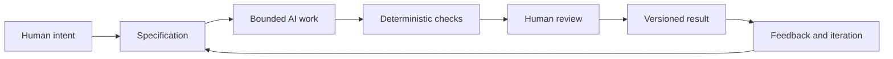

# Chapter 5: Synthesis — Persuasion, Archetypes, and Design Language in AI-Assisted Work

The earlier chapters each focus on a different lens:

- persuasion helps explain what response we are trying to enable;
- archetypes help explain what meaning or identity a product or message is carrying;
- design language helps explain how that meaning should look, feel, and be experienced.

Together, these three lenses form a practical framework for creative and technical work. They help answer three questions before a project gets too far along:

- What are we trying to make happen?
- What meaning or identity are we expressing?
- How should that meaning feel and appear?

This matters even more when AI is involved. A model can generate many options quickly, but it cannot automatically understand the boundary between a useful answer and a convincing but wrong answer. Without a clear structure, work can drift toward novelty without intention.

## A Working Framework

### Persuasion: What Response Are We Trying to Enable?

Persuasion is not only about overt sales language. It is about shaping attention, interpretation, trust, and action. A strong design or communication task should be clear about the response it wants to enable: inform, reassure, persuade, invite, confirm, or direct.

If the work is a product description, the designer may want the reader to compare options and decide confidently. If the work is a course summary, the designer may want the learner to understand a concept quickly and feel ready to continue.

### Archetype: What Meaning or Identity Are We Expressing?

Archetypes give a product, brand, or experience a recognizable emotional role. A brand might feel like an Explorer, Sage, Rebel, Caregiver, Hero, or any of several other patterns. The point is not to reduce a person to a type. It is to give communication a consistent emotional direction.

A good archetype helps answer the practical question: "What does the audience get to feel, imagine, or become by choosing this brand or experience?"

### Design Language: How Should That Meaning Look and Feel?

Design language gives the intended meaning a visible structure. This includes typography, spacing, composition, imagery, color, motion, pacing, and tone. A modernist visual language will feel different from a postmodern, luxurious, or experimental one.

This is where persuasion and archetype become visible. The message is not only what is said, but how it is composed and what it emphasizes.

## Why an AI Task Needs a Specification

A generative system is powerful, but it is also easy to misuse. Without a clear specification, a model may produce something elegant, plausible, and wrong. A specification creates boundaries.

A useful specification should explain:

- the task and desired outcome;
- the audience;
- the tone or archetype;
- the constraints and acceptable trade-offs;
- the criteria for success;
- the signs of failure or drift.

This is not a restriction on creativity. It is a way of making creativity more useful. A sharp brief gives the model direction, while still leaving room for insight and iteration.

## Deterministic Checks, Probabilistic Review, and Human Judgment

Not all validation is the same.

### Deterministic checks

Deterministic checks are rules that can be verified reliably. They include whether a file exists, whether markdown syntax is valid, whether a heading matches a requirement, whether a table has the expected number of columns, or whether a build script completes without error.

These checks are valuable because they are cheap, repeatable, and easy to automate. They do not decide whether something is excellent; they decide whether it meets explicit standards.

### Probabilistic review

AI review can be useful because it can scan for missing sections, awkward wording, weak logic, or inconsistent tone. But AI review is probabilistic: it is pattern-based and not guaranteed to be correct. It can miss subtleties and sometimes express a confident but mistaken judgment.

This means AI review should be treated as a helper, not a final authority. It is best used for quick feedback and broad scanning, then followed by deliberate human review.

### Human judgment

Humans remain responsible for judgment, meaning, truthfulness, context, and the final decision. A designer or author still has to decide whether the work is appropriate, fair, accurate, and genuinely useful for the situation.

A persuasive strategy may work technically but still be ethically weak. A visual style may be clever but misrepresent the actual product. A message might sound confident but fail to respect the audience's real needs. These are not issues a machine can settle definitively on its own.

## Why Version Control Matters When AI Is Generating Work

When AI is generating work, version control becomes a discipline of responsibility. Git gives teams traceability and recovery. It records what changed, when it changed, and who made that change. If a draft becomes misleading or the output drifts away from the specification, the project can revert to a previous version and compare iterations.

Version control matters because creative work is often iterative. Without a clear history, it becomes difficult to know which version was approved, which assumptions changed, and what was lost when a revision was made. In AI-assisted work, this is especially important because the model may produce plausible but imperfect alternatives quickly.

Good version control does not kill creativity. It creates a reliable trail so the team can recover, review, and improve without confusion.

## The Pit-Stop Metaphor

Think of a racing team during a pit stop. The car keeps moving, but selected moments deserve deliberate human attention: tires, fuel, alignment, and the final check before rejoining the race.

The same is true for AI-assisted work. Automation can keep running quickly and repeatedly, but the most important moments still deserve human inspection: the specification, the final direction, the evidence behind claims, the ethical framing, and the final decision to publish or ship.

This is not a call for slow, constant micromanagement. It is a call for deliberate review at the points where stakes are highest.

## The Complete Workflow

This workflow is meant to keep speed and control in balance. A clear intent leads to a tight specification. The AI then works within bounds. Deterministic checks catch obvious errors cheaply and consistently. Human review handles meaning, ethics, and context. Versioning preserves the work so it can be rechecked, restored, or improved as needed.

## Why This Matters

The three lenses from earlier chapters are not separate from technical work. They are a control framework for design decisions in a world where AI can produce a lot of output very quickly.

Persuasion tells us what response we want to enable. Archetypes tell us what meaning or identity the work should carry. Design language tells us how that meaning should appear and feel. Together, they help direct AI-generated work toward a real purpose rather than merely a plausible output.

## Questions for Next Week

- What kinds of AI tasks in your own work would benefit from a stronger specification?
- Which parts of a project should be checked deterministically, and which parts need human judgment?
- How could a chosen archetype and design language improve the clarity of an AI prompt?
- When does a persuasive design choice become manipulative instead of helpful?
- What would your workflow look like if every AI-generated draft were versioned and reviewable?

## What You Should Remember

Persuasion, archetype, and design language are not just terms for branding or advertising. They are a structure for directing communication and design choices. When paired with a clear specification, deterministic checks, targeted AI review, and disciplined version control, they become a practical framework for AI-assisted work. The main lesson is simple: speed without structure is not control, and human judgment remains the final source of meaning, truthfulness, and responsibility.
