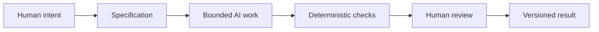

# Chapter 5: Synthesis — Directing AI with Intent, Identity, and Design

The final question is not “How can AI generate more?” It is “How can we direct AI so that it helps us make better work with less drift, confusion, and waste?” The answer is not a single trick or a perfect prompt. It is a design framework.

## One Framework for Directing AI

The three lenses from the earlier chapters work together as a practical control system for AI-assisted work.

- **Persuasion helps answer:** What response are we trying to enable?
- **Archetype helps answer:** What meaning or identity are we expressing?
- **Design language helps answer:** How should that meaning look and feel?

This matters because AI often produces outputs that are fluent, polished, and plausible without being well aimed. A model can sound confident while still being off-strategy. A persuasive message can be technically impressive but wrong for the audience. A visually attractive design can still communicate the wrong identity. The three lenses keep the work anchored to human intent.

A simple example is a landing page. Persuasion asks whether the page should inform, reassure, convert, or invite trust. Archetype asks whether the brand should sound reliable, rebellious, premium, warm, or minimal. Design language asks whether the page should feel calm and authoritative, playful and expressive, or minimal and efficient. If those questions are not answered, the AI is left guessing.

## Why a Task Needs a Specification

AI is powerful because it can generate many possibilities quickly, but uncontrolled generation is rarely useful. A task should be bounded by a specification.

A specification gives the model a clear operating context:

- the goal;
- the audience;
- the constraints;
- the required output;
- the acceptance criteria;
- the standards for quality and correctness.

Without a specification, an AI system may generate something that is generic, inconsistent, or overly broad. It may add features that were never requested. It may write in a tone that does not fit the brand. It may fill in missing information with made-up details. A spec reduces ambiguity before the model starts producing work.

A useful specification is not a long list of commands or an attempt to micromanage every sentence. It is a shared definition of the task. It creates a boundary around the work so the AI can move quickly within a defined frame. In other words, it turns a vague request into a manageable design problem.

## Why Version Control Matters

When AI is generating work, version control becomes essential. Git provides traceability and recovery.

A repository makes it possible to see the history of changes, compare versions, and revert when a model makes a bad turn. That is not only useful for code. It also helps with writing, design files, prompts, configurations, and other creative artifacts. A team can ask: What changed? Why did it change? What was the version before this decision?

This is especially important with AI because a model can produce a large number of outputs very quickly. Some will be promising; some will be dead ends. Without version control, it is easy to lose the good path or confuse a failed experiment with a valid direction. Git gives a structured way to recover and learn from the process.

A good workflow treats each version as evidence, not as a sacred final answer. If the output drifts, the system can go back to a previous checkpoint. If a design decision turns out to be wrong, the team can trace it to the moment it was introduced. That is part of responsible creative work.

## Why Deterministic Checks Matter

Not everything in a workflow should be left to a model. Deterministic automated checks are useful because they are cheap, repeatable, and fast.

These checks can include:

- syntax validation;
- linting or formatting checks;
- tests for required sections or expected structure;
- link validation;
- file integrity checks;
- formatting rules for a document or design system.

They are “deterministic” because they return the same result when the same input is given. This is valuable because they catch obvious errors before a human spends time reading the material. A broken markdown file, a missing heading, a failed test, or a misformatted link is a low-cost problem to catch early. The goal is not to replace judgment. The goal is to reduce the number of easy mistakes that consume attention.

This is the difference between a system that checks everything automatically and a system that asks a person to notice everything manually. Deterministic checks are a cheap and reliable layer of quality control.

## Why AI Review Is Useful but Probabilistic

AI can also be useful in review. It can scan a draft for missing arguments, inconsistent tone, unsupported claims, unclear structure, or mismatched brand language. It can highlight areas that need a closer look.

But AI review is probabilistic. It is not a guarantee of truth. It predicts patterns based on examples, not certainty. It may judge a sentence as strong even when the underlying claim is weak. It may overlook context. It may produce a confident but wrong explanation. It can be highly useful when treated as a second pair of eyes, not as the final authority.

This is where the pit-stop metaphor is helpful. In a race, the car keeps moving while the pit crew performs a fast, precise intervention at selected moments. Automation can keep running, but selected moments deserve deliberate human inspection. A team does not stop the whole process for every tiny event. Instead, it pauses at the moments where the stakes are highest: before publishing, before shipping, before a major decision, before a claim is made public.

## Why Humans Still Matter Most

Even with specifications, version control, deterministic checks, and AI review, humans remain responsible for judgment, meaning, truthfulness, context, and final decisions.

A person must decide:

- whether the work actually serves the stated goal;
- whether the message is honest and fair;
- whether the tone fits the audience and identity;
- whether a claim is supported by evidence;
- whether the context makes the decision correct in the real world.

This is where the human role is decisive. AI can help generate, compare, and test, but it cannot fully understand a community, a cultural context, a legal constraint, or the moral weight of a decision. A model may generate fluent language, but a person must decide whether that language is truthful, useful, and appropriate.

That is why the best AI-assisted systems do not remove human responsibility. They distribute the work. The model handles repetition and variation; the machine handles deterministic checks; the human handles meaning and final judgment.

## The Full Workflow

This workflow makes the process legible. Human intent sets the destination. The specification defines the boundary. AI generates within that boundary. Deterministic checks remove easy errors. Human review catches context, meaning, and judgment. The versioned result becomes traceable and recoverable.

## Putting the Three Lenses Together

The three lenses do more than describe style. They form a high-level control framework for AI-assisted creative and technical work.

- **Persuasion** asks what action or response the work should enable.
- **Archetype** asks what identity or meaning the work should express.
- **Design language** asks how that meaning should appear in the world.

Together, they prevent the common problem of AI drift: a model produces output that is technically competent but directionless. When we name the purpose, define the identity, and constrain the visual language, we give the machine a better target. We also make it easier for human reviewers to evaluate whether the work is actually on strategy.

The result is not a rigid system that removes creativity. It is a flexible system that makes creativity more intentional. AI can move quickly. Humans decide what matters. The specification keeps the work focused. The checks keep the work reliable. The review keeps the work responsible.

## Questions for Next Week

- How can you turn a vague project idea into a clear specification before asking AI to generate work?
- What questions would you ask to decide whether a design communicates the right archetype?
- Where should a human review happen in a workflow that otherwise uses automation heavily?
- What does version control add when a team is generating multiple drafts or prototypes?
- Which checks in your work could be made deterministic instead of manual?

## What You Should Remember

- Persuasion, archetype, and design language together create a practical framework for directing AI-assisted work.
- A specification helps bound the task and reduces drift, confusion, and low-quality outputs.
- Git gives teams traceability, comparison, and recovery when AI generates many versions.
- Deterministic checks are fast, repeatable, and useful for catching obvious errors cheaply.
- AI review is helpful but probabilistic; it should support judgment rather than replace it.
- Humans remain responsible for meaning, truthfulness, context, and the final decision.
- Good creative systems do not remove human oversight; they place it at the moments that matter most.
